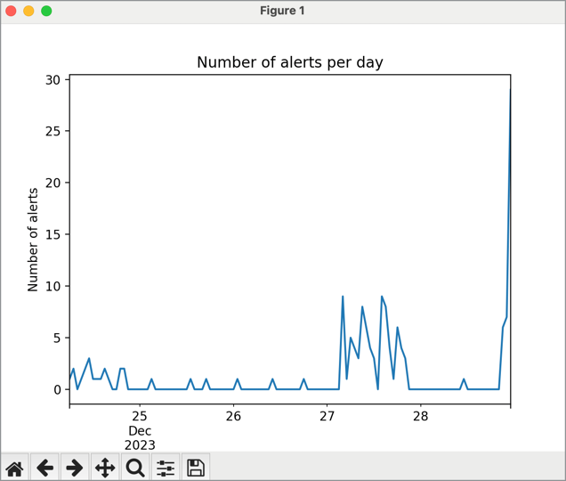
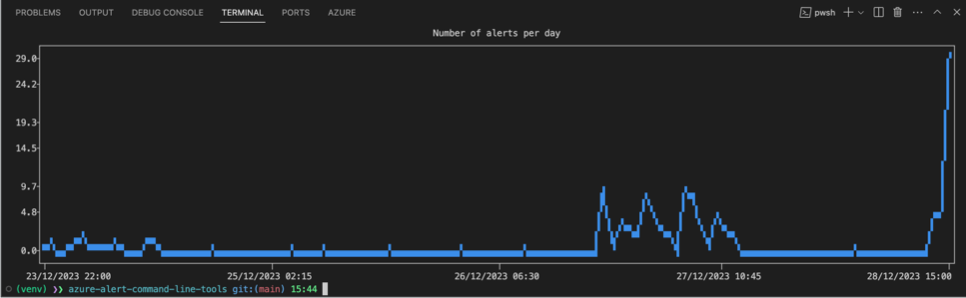

# Azure Alerts Command Line Tools

Fun project, attempting to create a command line tool to manage Azure Alerts which includes in terminal pltting and Open API integration.

## Details

So far, have used the `Pandas` library to create a dataframe of the Azure alerts. This can then be used to plot the data using native Pandas plotting capabilities, or using the awesome `plotext` library to plot in the terminal.

Pandas plotting example:

Plotext plotting example:

