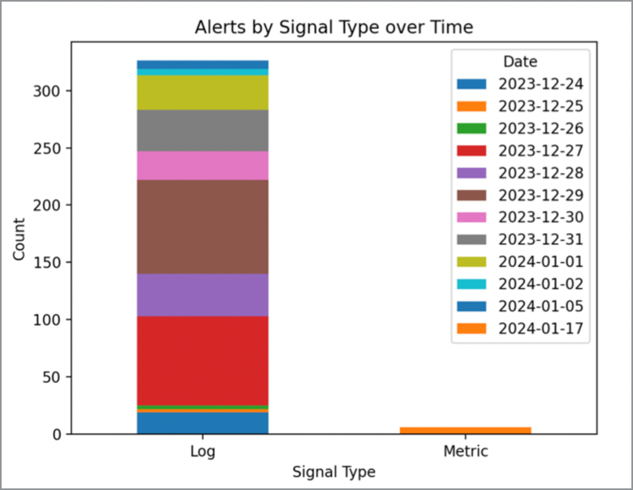

# Azure Alerts Command Line Tools

Fun project, attempting to create a command line tool to manage Azure Alerts which includes in terminal pltting and Open API integration.

## Details

So far, have used the `Pandas` library to create a dataframe of the Azure alerts. This can then be used to plot the data using native Pandas plotting capabilities, or using the awesome `plotext` library to plot in the terminal.

## Command examples:

*Get help:*

```
>> python ./main.py --help  

Usage: main.py [OPTIONS] COMMAND [ARGS]...

Options:
  --help  Show this message and exit.

Commands:
  load-alerts
  plot-console
  plot-pandas
```

*Load alerts:*

```
>> python ./main.py load-alerts --range 7d
```

*Plot alerts in console:*

```
python ./main.py plot-console
```

Results:


*Plot alerts using Pandas:*

```
python ./main.py plot-console
```

Results:


*Interactive mode with OpenAPI:*

```
python ./main.py pandas-ai

> Alerts loaded, please enter a query or type 'quit()' to exit

> Show all alerts

                                 severity signal_type alert_state  ...      last_modified_date_time monitor_condition_resolved_date_time last_modified_user_name
start_date_time                                                    ...                                                                                          
2023-12-24 06:56:27.051624+00:00     Sev3         Log         New  ...  2023-12-24T06:56:27.051624Z                                  NaN                  System
2023-12-24 07:06:23.500119+00:00     Sev3         Log         New  ...  2023-12-24T07:06:23.500119Z                                  NaN                  System
2023-12-24 07:21:23.281760+00:00     Sev3         Log         New  ...   2023-12-24T07:21:23.28176Z                                  NaN                  System
2023-12-24 09:16:22.544307+00:00     Sev3         Log         New  ...  2023-12-24T09:16:22.544307Z                                  NaN                  System
2023-12-24 10:06:22.893960+00:00     Sev3         Log         New  ...   2023-12-24T10:06:22.89396Z                                  NaN                  System
...                                   ...         ...         ...  ...                          ...                                  ...                     ...
2024-01-17 11:05:31.645543+00:00     Sev3      Metric         New  ...  2024-01-17T11:21:33.343087Z          2024-01-17T11:21:33.755204Z                  System
2024-01-17 15:26:38.328776+00:00     Sev3      Metric         New  ...  2024-01-17T15:37:38.379148Z          2024-01-17T15:37:38.771349Z                  System
2024-01-17 18:53:50.107724+00:00     Sev3      Metric         New  ...  2024-01-17T18:56:45.976983Z          2024-01-17T18:56:46.415631Z                  System
2024-01-17 18:57:52.388607+00:00     Sev3      Metric         New  ...  2024-01-17T19:04:46.051213Z           2024-01-17T19:04:46.43735Z                  System
2024-01-17 22:14:58.704809+00:00     Sev3      Metric         New  ...  2024-01-17T22:29:59.263473Z          2024-01-17T22:29:59.704696Z                  System

> how many alerts have a singnal type of log
6

> Plot all alerts by signal type over time
```

*Result from last command:*



## Notes

If you recieve a warning related to 'urllib3' when running the script on a Macintosh, see the following [Stack Overflow post](https://stackoverflow.com/questions/76187256/importerror-urllib3-v2-0-only-supports-openssl-1-1-1-currently-the-ssl-modug) for a solution.